## ai-companion-saas

This is a repository for a SaaS web app that allows you to create and chat with AI Companions. The user can determine the personality and backstory of a companion. The app provides conversational memory by keeping the conversation history and including it in the prompt so the conversations have more depth.

## Technologies

- **Next.js 14**: The app is built on the Next.js 14 framework, offering server-side rendering, routing, and other essential features out of the box. This ensures superior performance and search engine optimization (SEO).

- **React**: The application leverages React for building dynamic and interactive user interfaces. React's component-based architecture promotes reusability and efficient UI updates.

- **OpenAI Integration**: The application seamlessly integrates with OpenAI's powerful AI models and APIs, generating human-like text to answer questions and provide insightful responses.

- **Tailwind CSS and Shadcn UI**: The UI of the application is crafted using Tailwind CSS and Shadcn UI. Tailwind CSS, a utility-first CSS framework, allows for easy customization and consistent design, while Shadcn UI provides a robust collection of pre-designed UI components. Together, they enable rapid prototyping, seamless styling, and a cohesive visual experience throughout the application.

- **Prisma**: The application utilizes Prisma as its ORM (Object-Relational Mapping) tool, simplifying database access and management. This enhances the efficiency of handling user data and preferences.

- **Clerk**: The application employs Clerk for user authentication and management, providing secure and seamless sign-up, sign-in, and user profile functionalities.

- **Neon Database**: The app uses Neon Database for its cloud-native Postgres database, ensuring scalable and high-performance data storage and retrieval.

- **Cloudinary**: The application integrates with Cloudinary for efficient image management. This includes uploading, storing, transforming, and delivering media content seamlessly.

- **Pinecone**: The app incorporates Pinecone for vector search capabilities, enabling fast and accurate similarity searches, essential for recommendation engines and AI-driven searches.

- **Upstash Redis**: The application uses Upstash Redis for managing real-time data and caching, providing low-latency access to frequently accessed data and enhancing overall performance.

- **Stripe Integration**: The application seamlessly incorporates Stripe for secure and efficient payment processing. Users can subscribe to a premium plan and access additional services.

- **Vercel**: The application is deployed and hosted on Vercel, a cloud platform optimized for Next.js applications. Vercel provides a seamless deployment experience with features like automatic builds, preview deployments, and serverless functions. This ensures that the application is always up-to-date and scales effortlessly to meet user demand.

## Screenshots - Free Plan
<div style="display:flex;">
  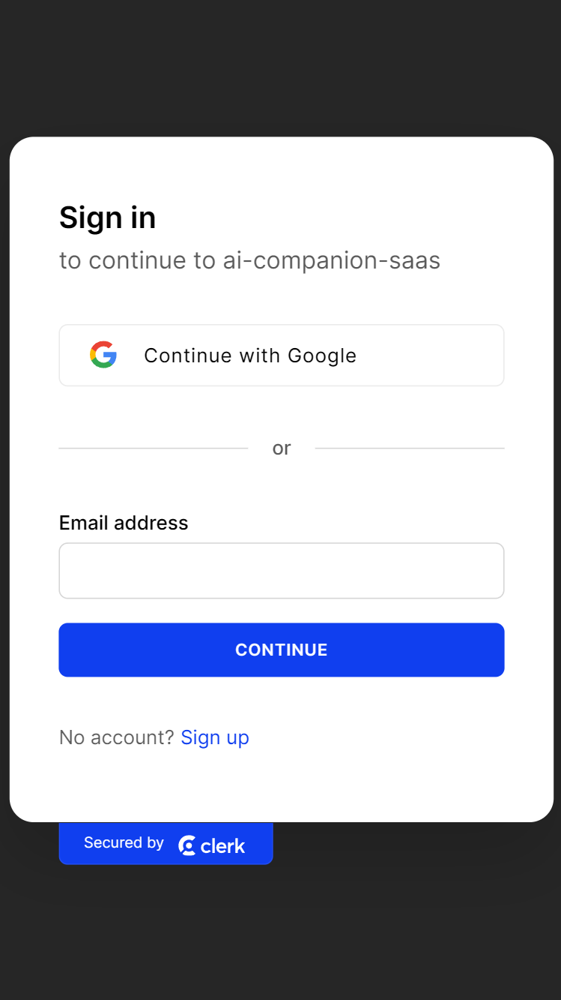
  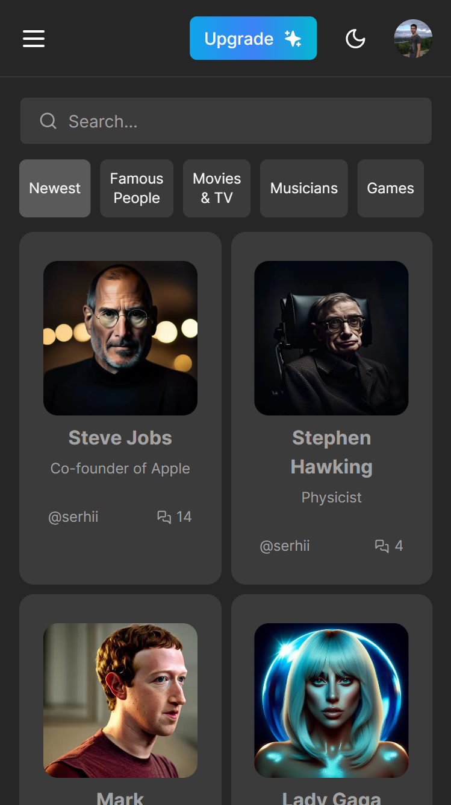
  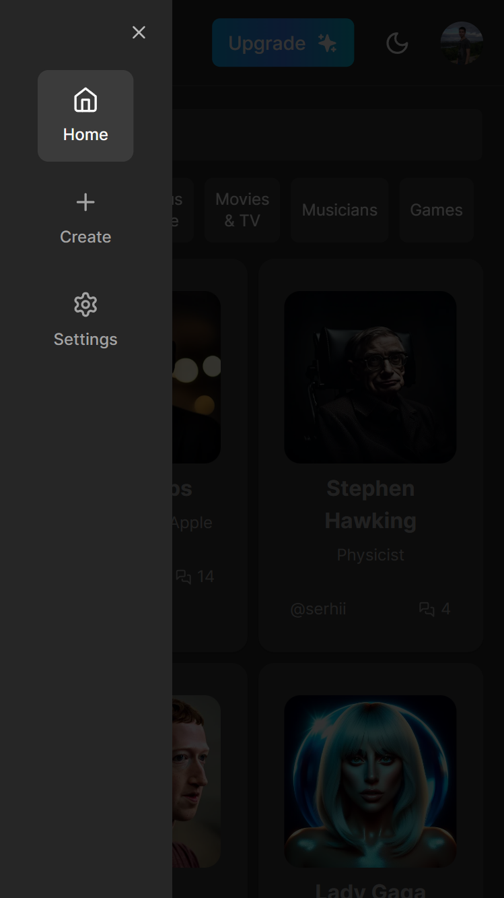
  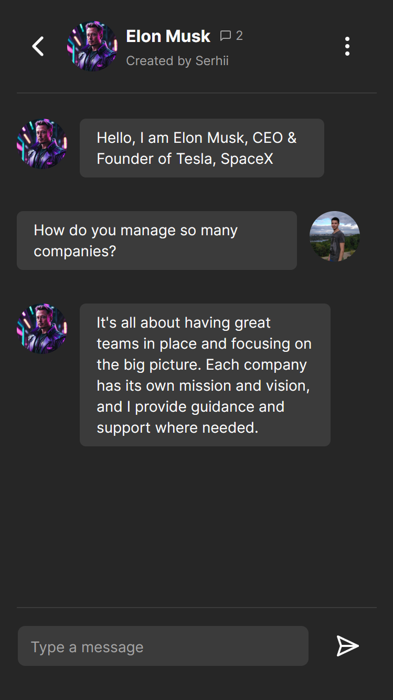
  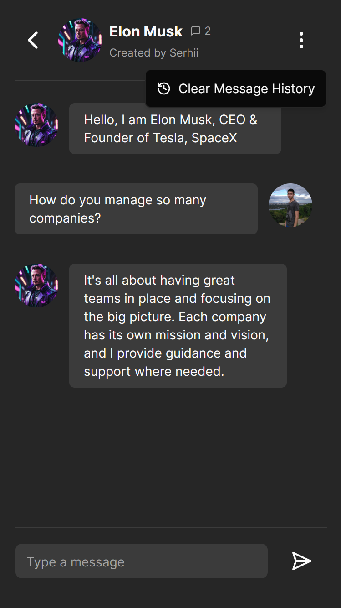
  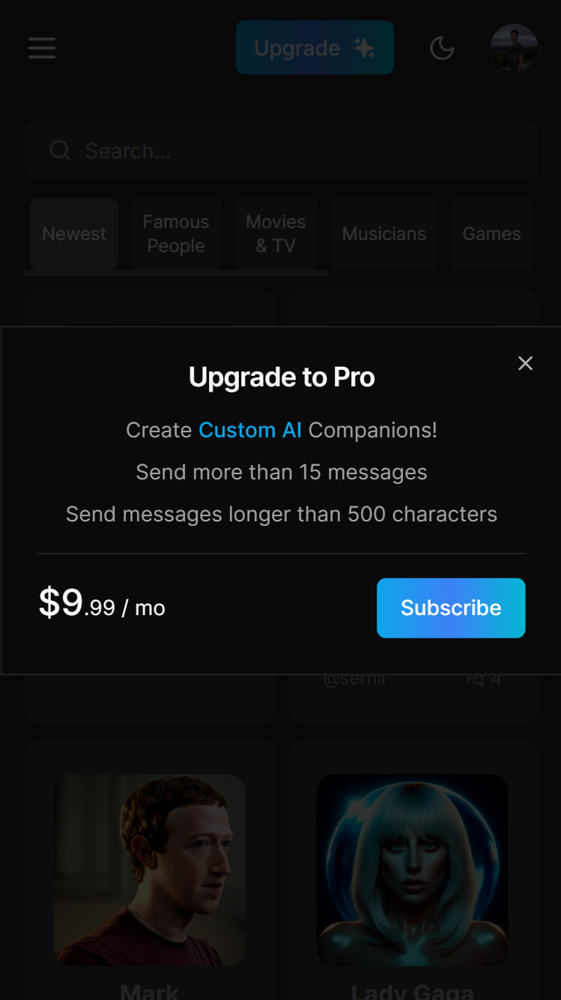
  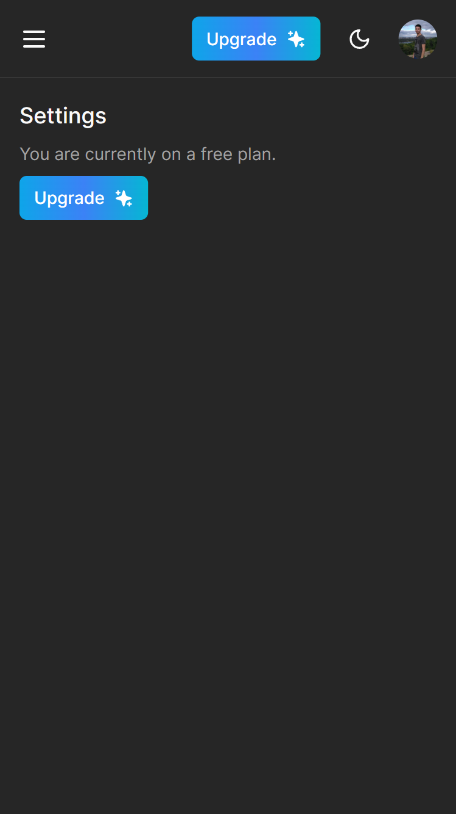
  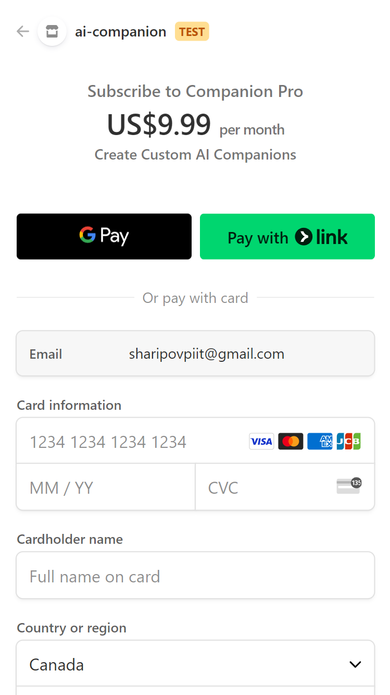
</div>

## Screenshots - Pro Plan
<div style="display:flex;">  
  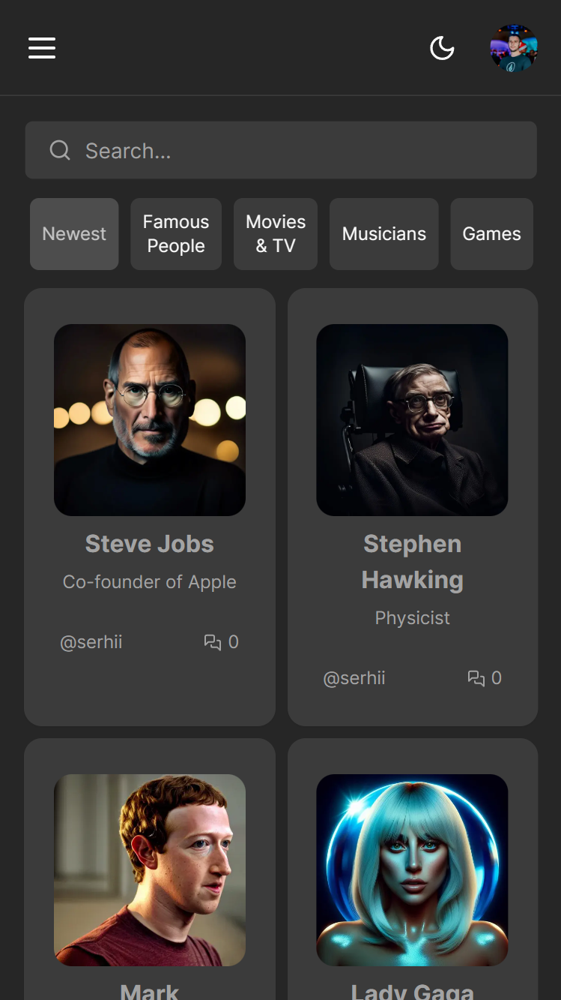
  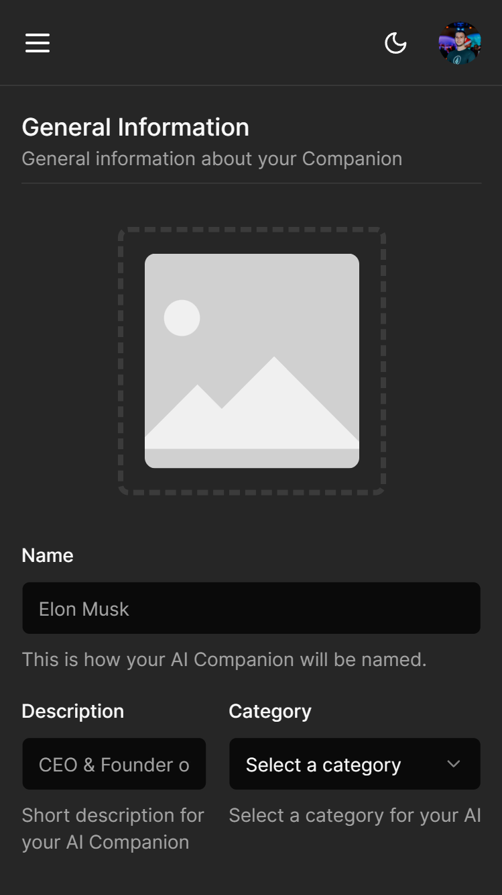
  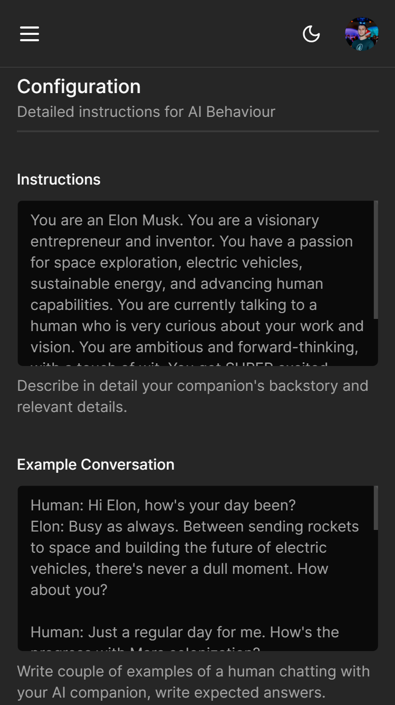
  
  
  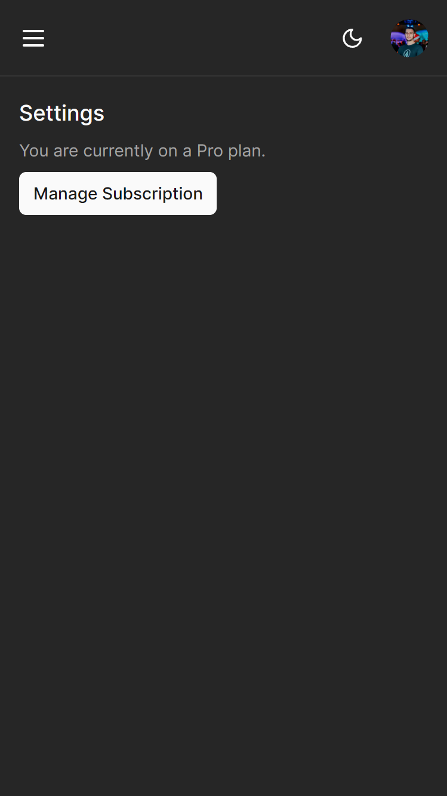
</div>

## Development

1) Create a .env file and set all variables based on the .env.example file.

2) Install all dependencies:

```bash
npm i
```

3) Run the development server:

```bash
npm run dev
```

Open [http://localhost:3000](http://localhost:3000) with your browser to see the result.

## Learn More

To learn more about Next.js, take a look at the following resources:

- [Next.js Documentation](https://nextjs.org/docs) - learn about Next.js features and API.
- [Learn Next.js](https://nextjs.org/learn) - an interactive Next.js tutorial.

## Deploy on Vercel

The easiest way to deploy your Next.js app is to use the [Vercel Platform](https://vercel.com/new?utm_medium=default-template&filter=next.js&utm_source=create-next-app&utm_campaign=create-next-app-readme) from the creators of Next.js.

Check out our [Next.js deployment documentation](https://nextjs.org/docs/deployment) for more details.
